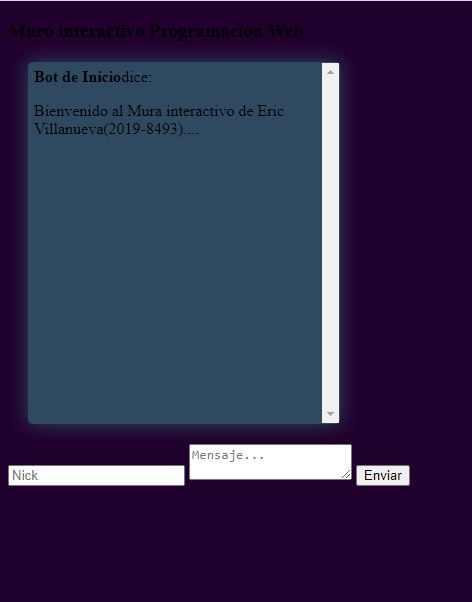
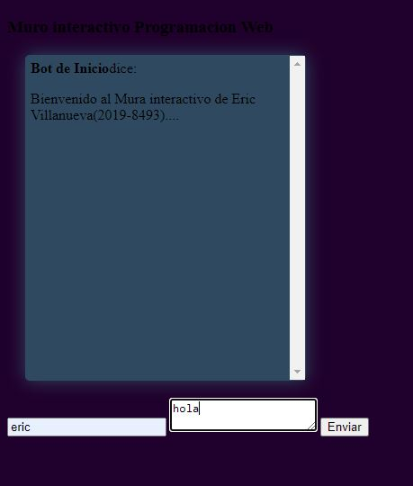
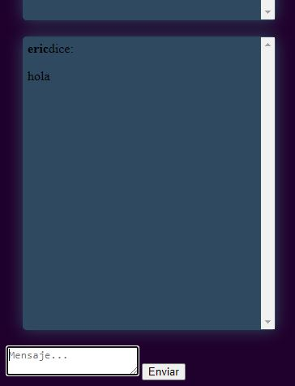
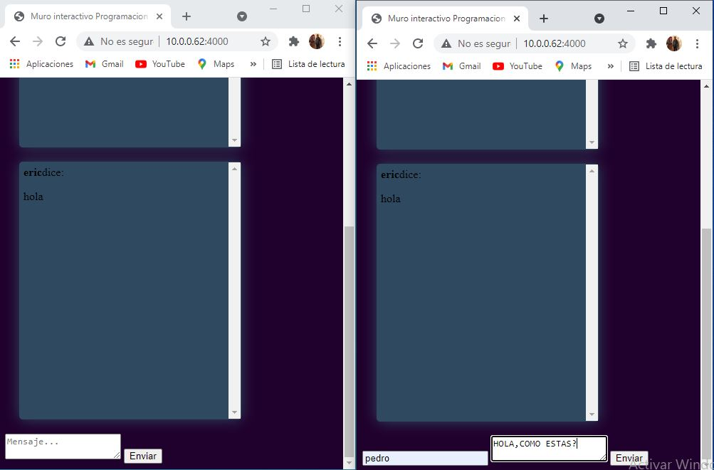
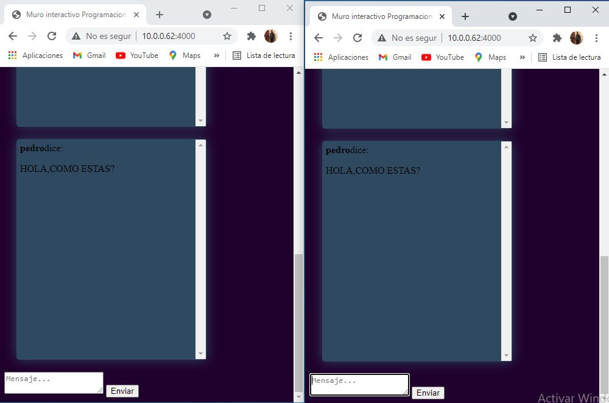

Proyecto Final

Esta es mi proyecto final, mi muro interactivo de la clase de programacion web Raydelto Hernández

NOTA IMPORTANTE: Maestro Raydelto yo Eric Villanueva le pidio mis mas sinceras  disculpas por este trabajo el cuan no esta del todo completo por dificultades tecnicas con la energia electrica que a arrollado mi sector por culpa de estas dos tormentas y que yo con el compromiso de cumplir realize este proyecto conmi mayor esfuerzo

Aqui esta como se ve en el navegador ejecuto el comando http://10.0.0.62:4000 :

Aqui voy a poner un nick name y un mensaje:

Aqui podemos ver que se envio el mensaje:

Aqui voy a agregar otro nickname y otro mensaje:

Y por ultimo aqui vemos como los vos mensaje se muestran en el muro en tiempo real 

